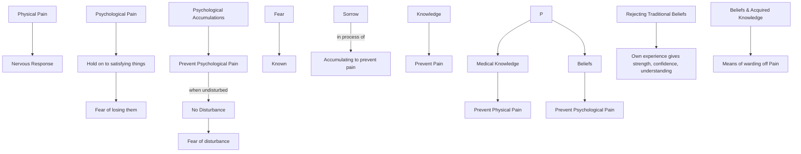

July 10
Acquiring beliefs to ward off pain

Physical pain is a nervous response, but psychological pain arises when I hold on to things that give me satisfaction, for then I am afraid of anyone or anything that may take them away from me. The psychological accumulations prevent psychological pain as long as they are undisturbed; that is, I am a bundle of accumulations, experiences, which prevent any serious form of disturbance — and I do not want to be disturbed. Therefore I am afraid of anyone who disturbs them. Thus my fear is of the known; I am afraid of the accumulations, physical or psychological, that I have gathered as a means of warding off pain or preventing sorrow. But sorrow is in the very process of accumulating to ward off psychological pain. Knowledge also helps to prevent pain. As medical knowledge helps to prevent physical pain, so beliefs help to prevent psychological pain, and that is why I am afraid of losing my beliefs, though I have no perfect knowledge or concrete proof of the reality of such beliefs. I may reject some of the traditional beliefs that have been foisted on me because my own experience gives me strength, confidence, understanding; but such beliefs and the knowledge which I have acquired are basically the same—a means of warding off pain.

