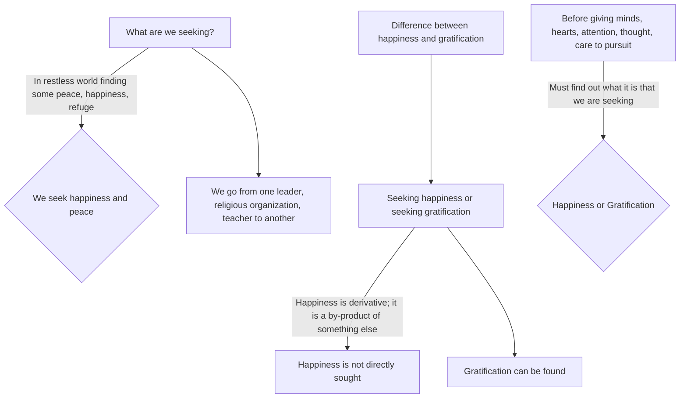

July 1
Happiness vs. gratification

What is it that most of us are seeking? What is it that each one of us wants? Especially in this restless world, where everybody is trying to find some kind of peace, some kind of happiness, a refuge, surely it is important to find out, isn’t it?, what it is that we are trying to seek, what it is that we are trying to discover? Probably most of us are seeking some kind of happiness, some kind of peace; in a world that is ridden with turmoil, wars, contention, strife, we want a refuge where there can be some peace. I think that is whatmost of us want. So we pursue, go from one leader to another, from one religious organization to another, from one teacher to another.
Now, is it that we are seeking happiness or is it that we are seeking gratification of some kind from which we hope to derive happiness? There is a difference between happiness and gratification. Can you seek happiness? Perhaps you can find gratification but surely you cannot find happiness. Happiness is derivative; it is a by-product of something else. So, before we give our minds and hearts to something which demands a great deal of earnestness, attention, thought, care, we must find out, must we not?, what it is that we are seeking; whether it is happiness, or gratification?

