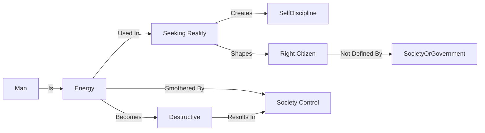

June 1
Energy creates its own discipline

Create a Mermaid Concept Map Diagram in text format identifying key concepts and keeping their names short  and name their relationships from this corresponding underlying text below from Jiddu Krishnamurti,  do not provide explanations or any further list or notes, only provide this Mermaid Concept Map Diagram in text format.

To seek reality requires immense energy; and, if man is not doing that, he dissipates his energy in ways that create mischief, and therefore society has to control him. Now, is it possible to liberate energy in seeking God or truth and, in the process of discovering what is true, to be a citizen who understands the fundamental issues of life and whom society cannot destroy?
You see, man is energy, and if man does not seek truth, this energy becomes destructive; therefore society controls and shapes the individual, which smothers this energy. And perhaps you have noticed another interesting and very simple fact that the moment you really want to do something, you have the energy to do it. That very energy becomes the means of controlling itself, so you don’t need outside discipline. In the search for reality, energy creates its own discipline. The man who is seeking reality spontaneously becomes the right kind of citizen, which is not according to the pattern of any particular society or government.

