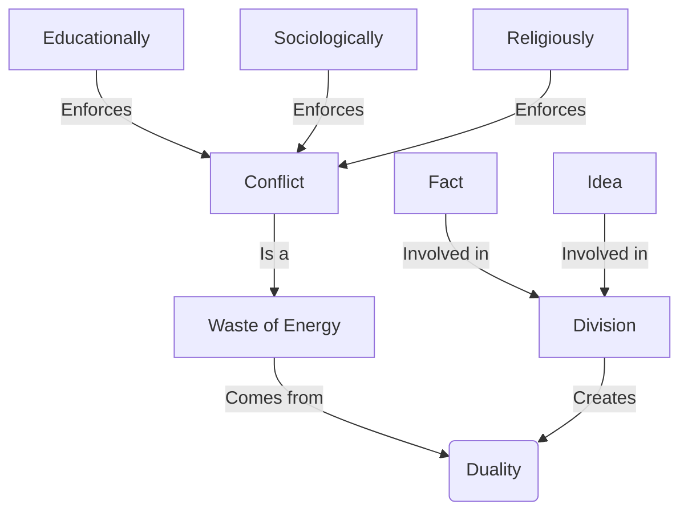

June 2
Duality creates conflict

Conflict of any kind — physically, psychologically, intellectually — is a waste of energy. Please, it is extraordinarily difficult to understand and to be free of this because most of us are brought up to struggle, to make effort. When we are at school, that is the first thing that we are taught — to make an effort. And that struggle, that effort is carried throughout life — that is, to be good you must struggle, you must fight evil, you must resist, control. So, educationally, sociologically, religiously, human beings are taught to struggle. You are told that to find God you must work, discipline, do practice, twist and torture your soul, your mind, your body, deny, suppress; that you must not look; that you must fight, fight, fight at that so-called spiritual level — which is not the spiritual level at all. Then, socially each one is out for himself, for his family.
So, all around, we are wasting energy. And that waste of energy in essence is conflict: the conflict between “I should” and “I should not,” “I must” and “I must not.” Once having created duality, conflict is inevitable. So one has to understand this whole process of duality — not that there is not man and woman, green and red, light and darkness, tall and short; all those are facts. But in the effort that goes into this division between the fact and the idea, there is the waste of energy.

