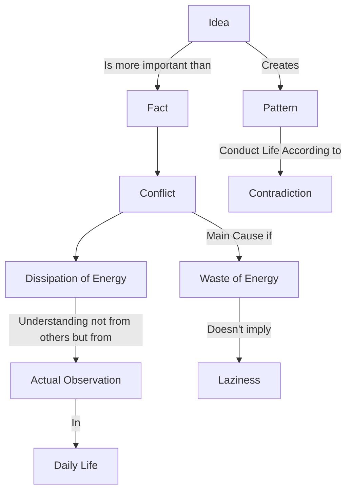

June 3
The pattern of an idea

If you say, “How am I to save energy?” then you have created a pattern of an idea — how to save it — and then conduct your life according to that pattern; therefore, there begins again a contradiction. Whereas if you perceive for yourself where your energies are being wasted, you will see that the principal force causing the waste is conflict — which is having a problem and never resolving it, living with a deadly memory of something gone, living in tradition. One has to understand the nature of the dissipation of energy, and the understanding of the dissipation of energy is not according to Shankara, Buddha or some saint, but the actual observation of one’s daily conflict in life. So the principal waste of energy is conflict — which doesn’t mean that you sit back and be lazy. Conflict will always exist as long as the idea is more important than the fact.

