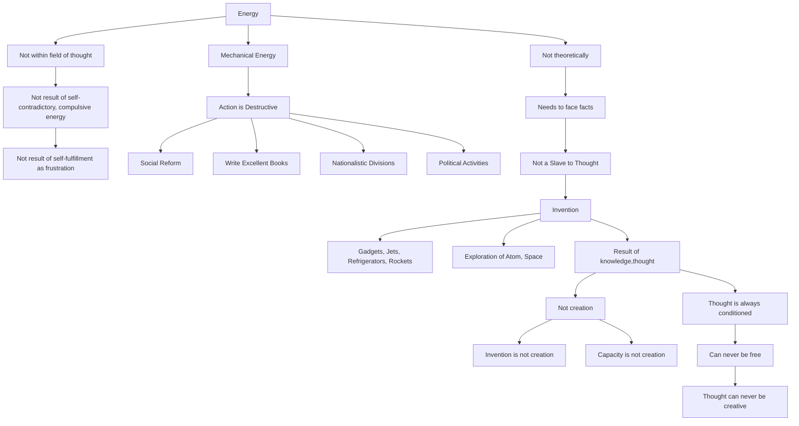

June 5
Creative energy

Now the question is: Is there an energy which is not within the field of thought, which is not the result of self-contradictory, compulsive energy, of self-fulfillment as frustration? You understand the question? I hope I am making myself clear. Because, unless we find the quality of that energy which is not merely the product of thought that bit by bit creates the energy but also is mechanical, action is destructive, whether we do social reform, write excellent books, be very clever in business, or create nationalistic divisions and take part in other political activities and so on. Now, the question is whether there is such an energy, not theoretically — because when we are confronted with facts, to introduce theories is infantile, immature. It is like the case of a man who has cancer and is to be operated upon; it is no good discussing what kinds of instruments are to be used and all the rest of it; you have to face the fact that he is to be operated upon. So, similarly, a mind has to penetrate or be in such a state when the mind is not a slave to thought. After all, all thought in time is invention; all the gadgets, jets, the refrigerators, the rockets, the exploration into the atom, space, they are all the result of knowledge, thought. All these are not creation; invention is not creation; capacity is not creation; thought can never be creative because thought is always conditioned and can never be free. It is only that energy which is not the product of thought that is creative.

