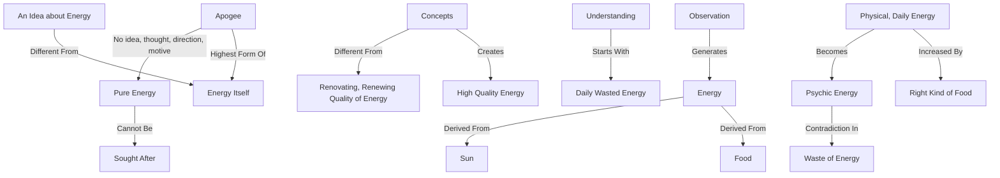

June 6
The highest form of energy

An idea about energy is entirely different from the fact of energy itself. We have formulas or concepts of how to bring about a quality of energy that is of the highest quality. But the formula is entirely different from the renovating, renewing quality of energy itself.
The highest form of this energy, the apogee, is the state of mind when it has no idea, no thought, no sense of a direction or motive — that is pure energy. And that quality of energy cannot be sought after. You can’t say, “Well, tell me how to get it, the modus operandi, the way.” There is no way to it. To find out for ourselves the nature of this energy, we must begin to understand the daily energy that is wasted — the energy when we talk, when we hear a bird, a voice, when we see the river, the vast sky and the villagers, dirty, ill kept, ill, half-starved, and the tree that withdraws of an evening from all the light of day. The very observation of everything is energy. And this energy we derive through food, through the sun’s rays. This physical, daily energy that one has, obviously can be augmented, increased, by the right kind of food and so on. That is necessary, obviously. But that same energy which becomes the energy of the psyche — that is, thought — the moment that energy has any contradiction in itself, that energy is a waste of energy.

