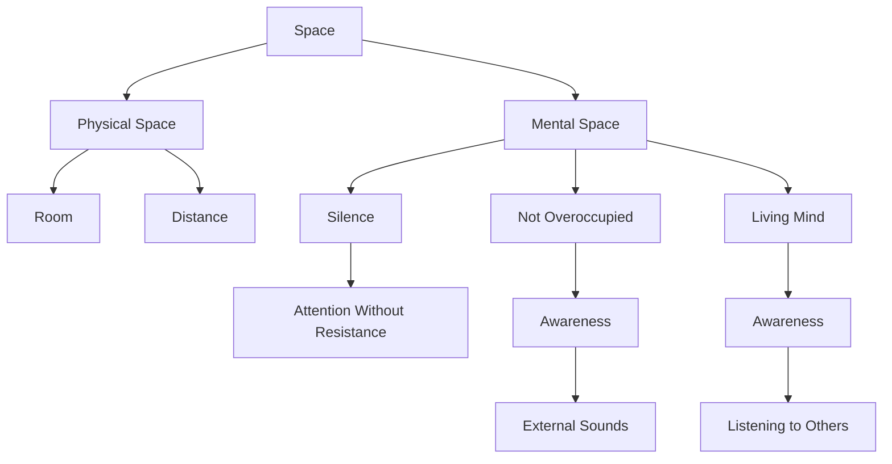

June 8
Attention without resistance

You know what space is. There is space in this room. The distance between here and your hostel, between the bridge and your home, between this bank of the river and the other — all that is space. Now, is there also space in your mind? Or is it so crowded that there is no space in it at all? If your mind has space, then in that space there is silence — and from that silence everything else comes, for then you can listen, you can pay attention without resistance. That is why it is very important to have space in the mind. If the mind is not overcrowded, not ceaselessly occupied, then it can listen to that dog barking, to the sound of a train crossing the distant bridge, and also be fully aware of what is being said by a person talking here. Then the mind is a living thing, it is not dead.

