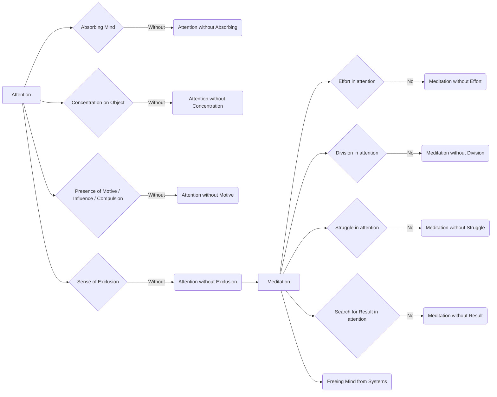

June 9
Attention free of effort

Is there attention without anything absorbing the mind? Is there attention without concentrating upon an object? Is there attention without any form of motive, influence, compulsion? Can the mind give full attention without any sense of exclusion? Surely it can, and that is the only state of attention; the others are mere indulgence, or tricks of the mind. If you can give full attention without being absorbed in something, and without any sense of exclusion, then you will find out what it is to meditate; because in that attention there is no effort, no division, no struggle, no search for a result. So meditation is a process of freeing the mind from systems, and of giving attention without either being absorbed, or making an effort to concentrate.

