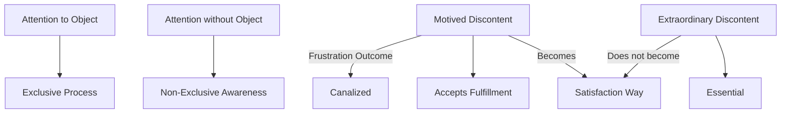

June 10
An attention that is not exclusive

I think there is a difference between the attention that is given to an object, and attention without object. We can concentrate on a particular idea, belief, object — which is an exclusive process; and there is also an attention, an awareness, which is not exclusive. Similarly, there is a discontent which has no motive, which is not the outcome of some frustration, which cannot be canalized, which cannot accept any fulfilment. Perhaps I may not be using the right word for it, but I think that that extraordinary discontent is the essential. Without that, every other form of discontent merely becomes a way to satisfaction.

