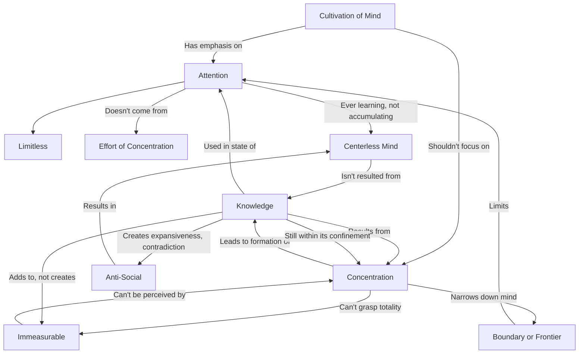

June 11
Attention is limitless, without frontiers

In the cultivation of the mind, our emphasis should not be on concentration, but on attention. Concentration is a process of forcing the mind to narrow down to a point, whereas attention is without frontiers. In that process the mind is always limited by a frontier or boundary, but when our concern is to understand the totality of the mind, mere concentration becomes a hindrance. Attention is limitless, without the frontiers of knowledge. Knowledge comes through concentration, and any extension of knowledge is still within its own frontiers. In the state of attention the mind can and does use knowledge, which of necessity is the result of concentration; but the part is never the whole, and adding together the many parts does not make for the perception of the whole. Knowledge, which is the additive process of concentration does not bring about the understanding of the immeasurable. The total is never within the brackets of a concentrated mind.
So attention is of primary importance, but it does not come through the effort of concentration. Attention is a state in which the mind is ever learning without a center around which knowledge gathers as accumulated experience. A mind that is concentrated upon itself uses knowledge as a means of its own expansion; and such activity becomes self-contradictory and anti-social.

