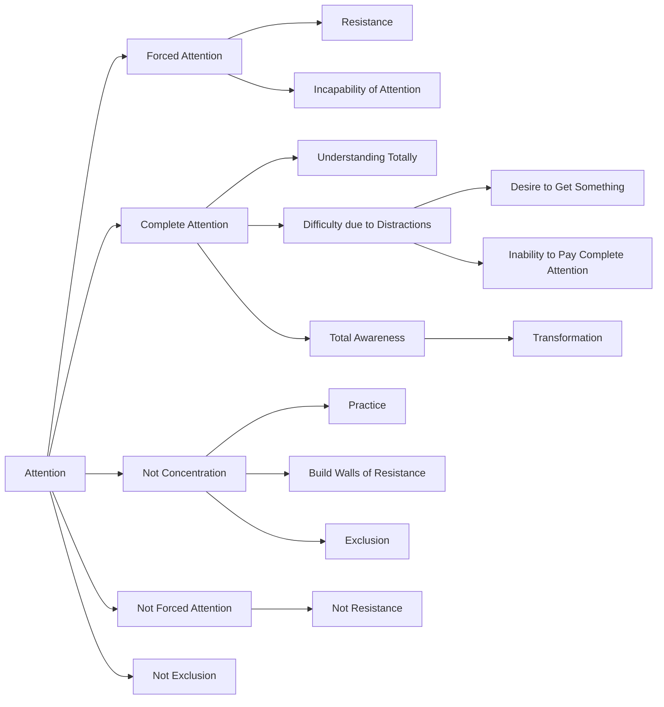

June 12
Complete attention

What do we mean by attention? Is there attention when I am forcing my mind to attend? When I say to myself, “I must pay attention, I must control my mind and push aside all other thoughts,” would you call that attention? Surely that is not attention. What happens when the mind forces itself to pay attention? It creates a resistance to prevent other thoughts from seeping in; it is concerned with resistance, with pushing away; therefore it is incapable of attention. That is true, is it not?
To understand something totally you must give your complete attention to it. But you will soon find out how extraordinarily difficult that is, because your mind is used to being distracted, so you say, “By Jove, it is good to pay attention, but how am I to do it?” That is, you are back again with the desire to get something, so you will never pay complete attention...When you see a tree or a bird, for example, to pay complete attention is not to say, ”That is an oak,” or, “That is a parrot,” and walk by. In giving it a name you have already ceased to pay attention...Whereas, if you are wholly aware, totally attentive when you look at something, then you will find that a complete transformation takes place, and that total attention is the good. There is no other, and you cannot get total attention by practice. With practice you get concentration, that is, you build up walls of resistance, and within those walls of resistance is the concentrator, but that is not attention, it is exclusion.

