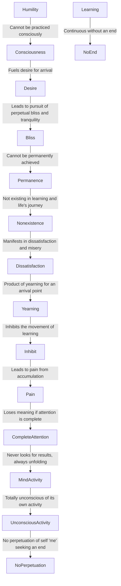

June 14
There is no place at which to arrive

Can humility be practiced? Surely, to be conscious that you are humble, is not to be humble. You want to know that you have arrived. This indicates, does it not?, that you are listening in order to achieve a particular state, a place where you will never be disturbed, where you will find everlasting happiness, permanent bliss. But as I said previously, there is no arriving, there is only the movement of learning—and that is the beauty of life. If you have arrived, there is nothing more. And all of you have arrived, or you want to arrive, not only in your business, but in everything you do; so you are dissatisfied, frustrated, miserable. Sirs, there is no place at which to arrive, there is just this movement of learning which becomes painful only when there is accumulation. A mind that listens with complete attention, will never look for a result because it is constantly unfolding; like a river, it is always in movement. Such a mind is totally unconscious of its own activity, in the sense that there is no perpetuation of a self, of a “me,” which is seeking to achieve an end.

