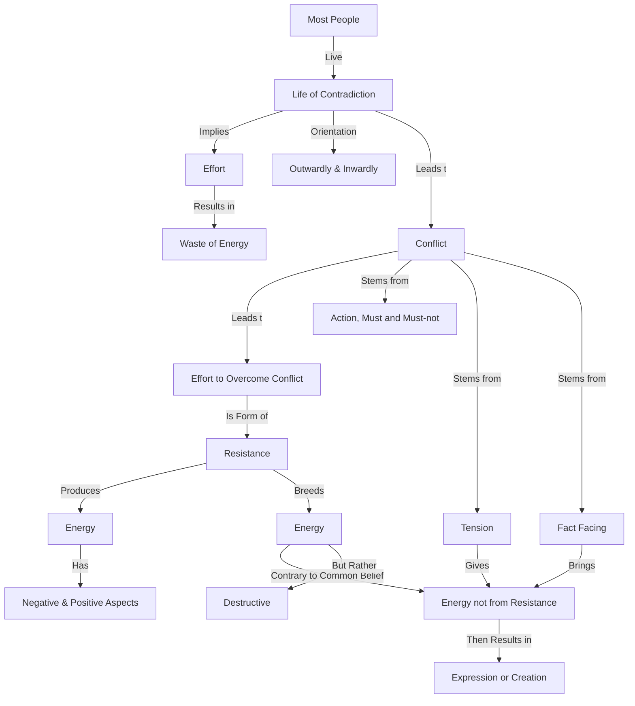

June 4
Where there is contradiction there is conflict

You see that most of us are in conflict, live a life of contradiction, not only outwardly, but also inwardly. Contradiction implies effort. Where there is effort, there is wastage — there is a waste of energy. Where there is contradiction, there is conflict. Where there is conflict, there is effort to get over that conflict — which is another form of resistance. And where you resist, there is also a certain form of energy engendered — you know that when you resist something, that very resistance creates energy.
All action is based on this friction that I must and I must not. And this form of resistance, this form of conflict, does breed energy; but that energy, if you observe very closely, is very destructive; it is not creative. Most people are in contradiction. And if they have a gift, a talent to write or to paint or to do this or that, the tension of that contradiction gives them the energy to express, to create, to write, to be. The more the tension, the greater the conflict, the greater is the output, and that is what we call creation. But it is not at all creation. It is the result of conflict. To face the fact that you are in conflict, that you are in contradiction, will bring that quality of energy that is not the outcome of resistance.

