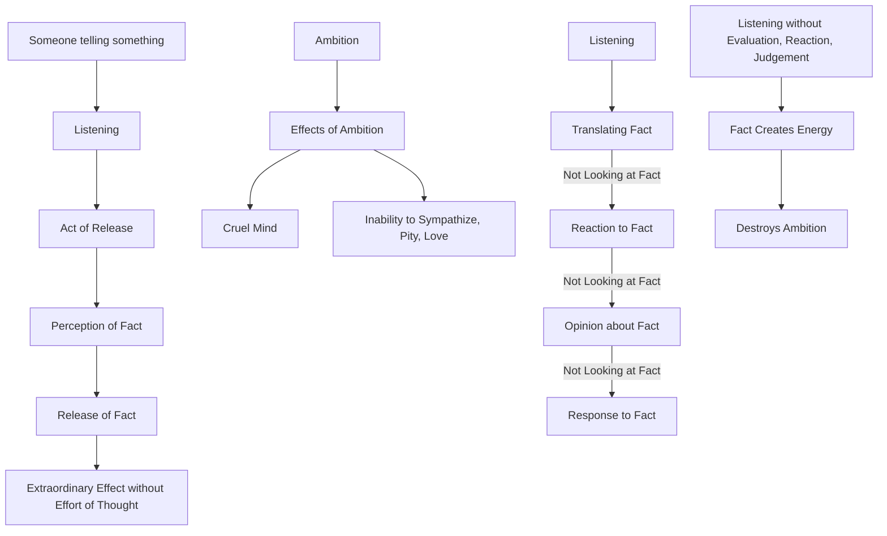

June 7
The act of listening to a fact will free the mind

Somebody is telling you something, you listen. The very act of listening is the act of release. When you see the fact, the very perception of that fact is the release of that fact. The very listening, the very seeing of something as a fact, has an extraordinary effect without the effort of thought.
Let us take one thing — say ambition. We have gone sufficiently into what it does, what its effects are. A mind that is ambitious can never know what it is to sympathize, to have pity, to love. An ambitious mind is a cruel mind — whether spiritually or outwardly or inwardly. You have heard it. You hear it; when you hear that, you translate it and say, “How can I live in this world which is built on ambition?” Therefore, you have not listened. You have responded, you have reacted to a statement, to a fact; therefore, you are not looking at the fact. You are merely translating the fact or giving an opinion about the fact or responding to the fact; therefore, you are not looking at the fact. If one listens — in the sense without any evaluation, reaction, judgment — surely then, the fact creates that energy which destroys, wipes away, sweeps away ambition which creates conflict.

