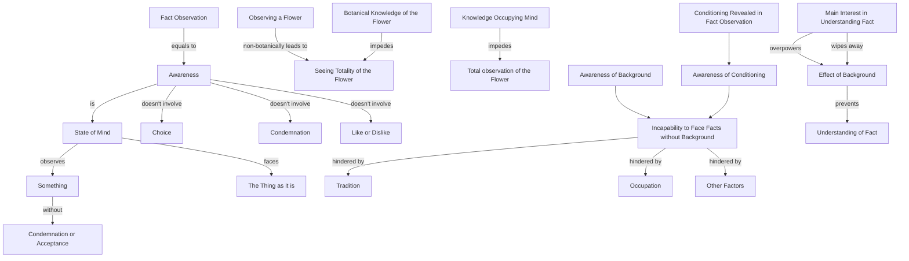

June 15
Knowledge is not awareness

Awareness is that state of mind which observes something without any condemnation or acceptance, which merely faces the thing as it is. When you look at a flower non botanically, then you see the totality of the flower; but if your mind is completely taken up with the botanical knowledge of what the flower is, you are not totally looking at the flower. Though you may have knowledge of the flower, if that knowledge takes the whole ground of your mind, the whole field of your mind, then you are not looking totally at the flower.
So, to look at a fact is to be aware. In that awareness, there is no choice, no condemnation, no like or dislike. But most of us are incapable of doing this because traditionally, occupationally, in every way, we are not capable of facing the fact without the background. We have to be aware of the background. We have to be aware of our conditioning, and that conditioning shows itself when we observe a fact; and as you are concerned with the observation of the fact and not with the background, the background is pushed aside. When the main interest is to understand the fact only, and when you see that the background prevents you from understanding the fact, then the vital interest in the fact wipes away the background.

