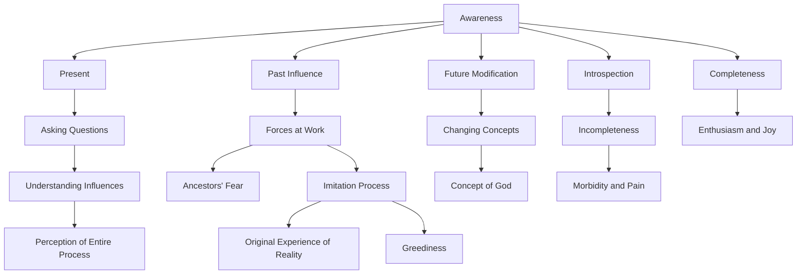

June 16
Introspection is incomplete

In awareness there is only the present — that is, being aware, you see the past process of influence which controls the present and modifies the future. Awareness is an integral process, not a process of division. For example, if I ask the question, “Do I believe in God,” — in the very process of asking, I can observe, if I am aware, what it is that is making me ask that question; if I am aware I can perceive what have been and what are the forces at work which are compelling me to ask that question. Then I am aware of various forms of fear — those of my ancestors who have created a certain idea of God and have handed it down to me, and combining their idea with my present reactions, I have modified or changed the concept of God. If I am aware I perceive this entire process of the past, its effect in the present and in the future, integrally, as a whole.
If one is aware, one sees how through fear one’s concept of God arose; or perhaps there was a person who had an original experience of reality or of God and communicated it to another who in his greediness made it his own, and gave impetus to the process of imitation. Awareness is the process of completeness, and introspection is incomplete. The result of introspection is morbid, painful, whereas awareness is enthusiasm and joy.

