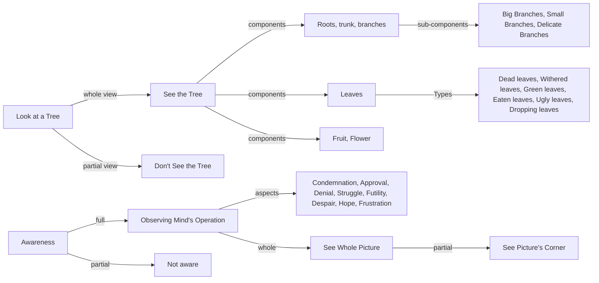

une 17
Seeing the whole

How do you look at a tree? Do you see the whole of the tree? If you don’t see it as a whole, you don’t see the tree at all. You may pass it by and say, “There is a tree, how nice it is!” or say, “It is a mango tree,” or “I do not know what those trees are; they may be tamarind trees.” But when you stand and look — I am talking actually, factually — you never see the totality of it; and if you don’t see the totality of the tree, you do not see the tree. In the same way is awareness. If you don’t see the operations of your mind totally in that sense — as you see the tree — you are not aware. The tree is made up of the roots, the trunk, the branches, the big ones and the little ones and the very delicate one that goes up there; and the leaf, the dead leaf, the withered leaf and the green leaf, the leaf that is eaten, the leaf that is ugly, the leaf that is dropping, the fruit, the flower — all that you see as a whole when you see the tree. In the same way, in that state of seeing the operations of your mind, in that state of awareness, there is your sense of condemnation, approval, denial, struggle, futility, the despair, the hope, the frustration; awareness covers all that, not just one part. So, are you aware of your mind in that very simple sense, as seeing a whole picture — not one corner of the picture and saying, “Who painted that picture?”

