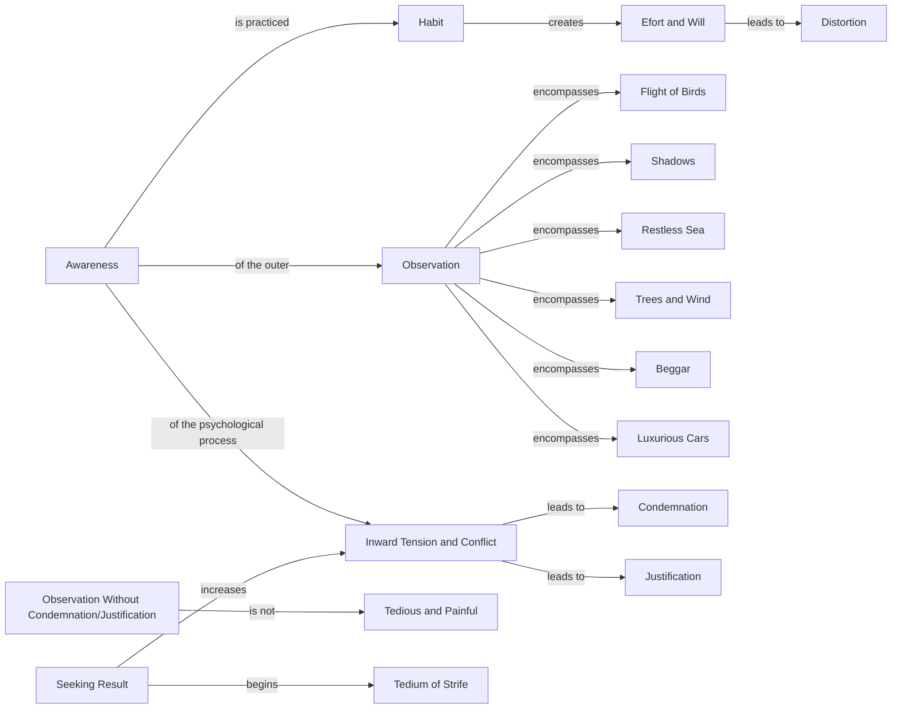

June 18
Awareness cannot be disciplined

If awareness is practiced, made into a habit, then it becomes tedious and painful. Awareness cannot be disciplined. That which is practiced is no longer awareness, for in practice is implied the creation of habit, the exertion of effort and will. Effort is distortion. There is not only the awareness of the outer — of the flight of birds, of shadows, of the restless sea, the trees and the wind, the beggar and the luxurious cars that pass by — but also there is the awareness of the psychological process, the inward tension and conflict. You do not condemn a bird in flight; you observe it, you see the beauty of it. But, when you consider your own inward strife, you condemn it or justify it. You are incapable of observing this inward conflict without choice or justification.
To be aware of your thought and feeling without identification and denial is not tedious and painful, but in search of a result, an end to be gained, conflict is increased and the tedium of strife begins.

