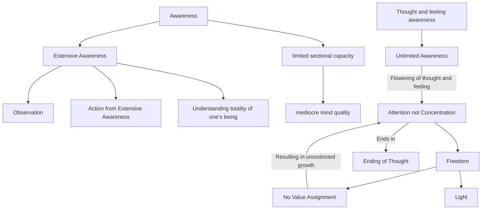

June 19
Let a thought flower

Awareness is that state of mind which takes in everything — the crows flying across the sky, the flowers on the trees, the people sitting in front, the colors they are wearing — being extensively aware, which needs watching, observing, taking in the shape of the leaf, the shape of the trunk, the shape of the head of another, what he is doing. To be extensively aware and from there acting — that is to be aware of the totality of one’s own being. To have a mere sectional capacity, a fragmentation of capacity or capacity fragmented, and to pursue that capacity and derive experience through that capacity which is limited — that makes the quality of the mind mediocre, limited, narrow. But an awareness of the totality of one’s own being, understood through the awareness of every thought and every feeling, and never limiting it, letting every thought and every feeling flower, and therefore being aware—that is entirely different from action or concentration which is merely capacity and therefore limited.
To let a thought flower or a feeling flower requires attention — not concentration. I mean by the flowering of a thought giving freedom to it to see what happens, what is taking place in your thought, in your feeling. Anything that flowers must have freedom, must have light; it cannot be restricted. You cannot put any value on it, you cannot say, “That is right, that is wrong; this should be, and that should not be” — thereby, you limit the flowering of thought. And it can only flower in this awareness. Therefore, if you go into it very deeply, you will find that this flowering of thought is the ending of thought.

