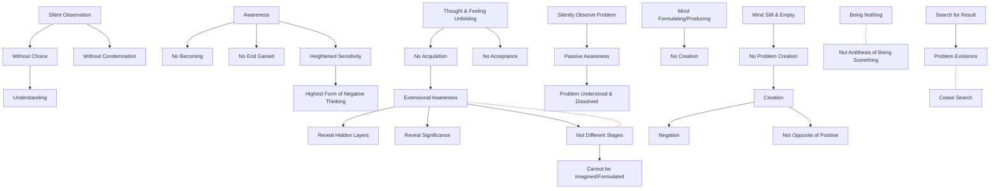

June 20
Passive awareness

In awareness there is no becoming, there is no end to be gained.
There is silent observation without choice and condemnation, from which there comes understanding. In this process when thought and feeling unfold themselves, which is only possible when there is neither acquisition nor acceptance, then there comes an extensional awareness, all the hidden layers and their significance are revealed. This awareness reveals that creative emptiness which cannot be imagined or formulated. This extensional awareness and the creative emptiness are a total process and are not different stages. When you silently observe a problem without condemnation, justification, there comes passive awareness. In this passive awareness, the problem is understood and dissolved. In awareness there is heightened sensitivity, in which there is the highest form of negative thinking. When the mind is formulating, producing, there can be no creation. It is only when the mind is still and empty, when it is not creating a problem — in that alert passivity there is creation. Creation can only take place in negation, which is not the opposite of the positive. Being nothing is not the antithesis of being something. A problem comes into being only when there is a search for result. When the search for result ceases, then only is there no problem.

