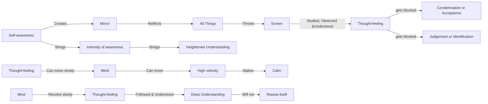

June 21
What is thoroughly understood will not repeat itself

In self-awareness there is no need for confession, for self-awareness creates the mirror in which all things are reflected without distortion. Every thought - feeling is thrown, as it were, on the screen of awareness to be observed, studied and understood; but this flow of understanding is blocked when there is condemnation or acceptance, judgment or identification. The more the screen is watched and understood — not as a duty or enforced practice, but because pain and sorrow have created the insatiable interest that brings its own discipline — the greater the intensity of awareness, and this in turn brings heightened understanding.
You can follow a thing if it moves slowly; a rapid machine must be made to slow down if one is to study its movements. Similarly, thoughts - feelings can be studied and understood only if the mind is capable of proceeding slowly; but once it has awakened this capacity, it can move at a high velocity, which makes it extremely calm. When revolving at high speed the several blades of a fan appear to be a solid sheet of metal. Our difficulty is to make the mind revolve slowly so that each thought - feeling can be followed and understood. What is deeply and thoroughly understood will not repeat itself.

