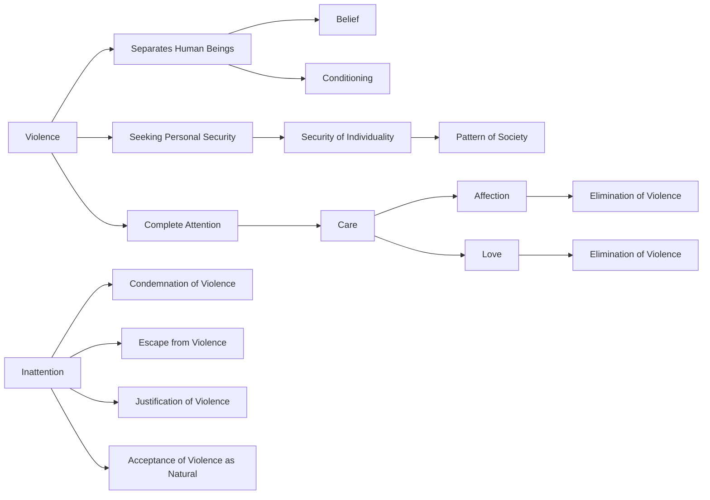

June 22 
Violence

What takes place when you give complete attention to the thing that we call violence? — violence being not only what separates human beings, through belief, conditioning, and so on, but also what comes into being when we are seeking personal security, or the security of individuality through a pattern of society. Can you look at that violence with complete attention? And when you look at that violence with complete attention, what takes place? When you give complete attention to anything — your learning of history or mathematics, looking at your wife or your husband — what takes place? I do not know if you have gone into it — probably most of us have never given complete attention to anything — but when you do, what takes place? Sirs, what is attention? Surely when you are giving complete attention there is care, and you cannot care if you have no affection, no love. And when you give attention in which there is love, is there violence? You are following? Formally I have condemned violence, I have escaped from it, I have justified it, I have said it is natural. All these things are inattention. But when I give attention to what I have called violence — and in that attention there is care, affection, love — where is there space for violence?

