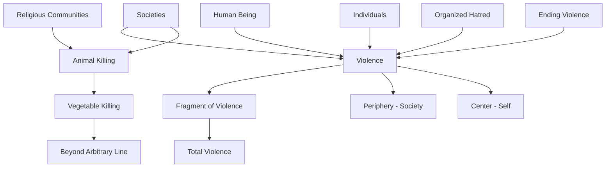

June 23
Is it possible to end this violence?

When you talk about violence, what do you mean by it? It is really quite an interesting question, if you go into it deeply, to inquire whether a human being, living in this world, can totally cease to be violent. Societies, religious communities, have tried not to kill animals. Some have even said, “If you don’t want to kill animals, what about the vegetables?” You can carry it to such an extent that you would cease to exist. Where do you draw the line? Is there an arbitrary line according to your ideal, to your fancy, to your norm, to your temperament, to your conditioning, and you say, “I’ll go up to there but not beyond?” Is there a difference between individual anger, with violent action on the part of the individual, and the organized hatred of a society which breeds and builds up an army to destroy another society? Where, at what level, and what fragment of violence are you discussing, or do you want to discuss whether man can be free of total violence, not a particular fragment which he calls violence?
We know what violence is without expressing in words, in phrases, in action. As a human being in whom the animal is still very strong, in spite of centuries of so-called civilization, where shall I begin? Shall I begin at the periphery, which is society, or at the center, which is myself? You tell me not to be violent, because it is ugly. You explain to me all the reasons, and I see that violence is a terrible thing in human beings, outwardly and inwardly. Is it possible to end this violence?

