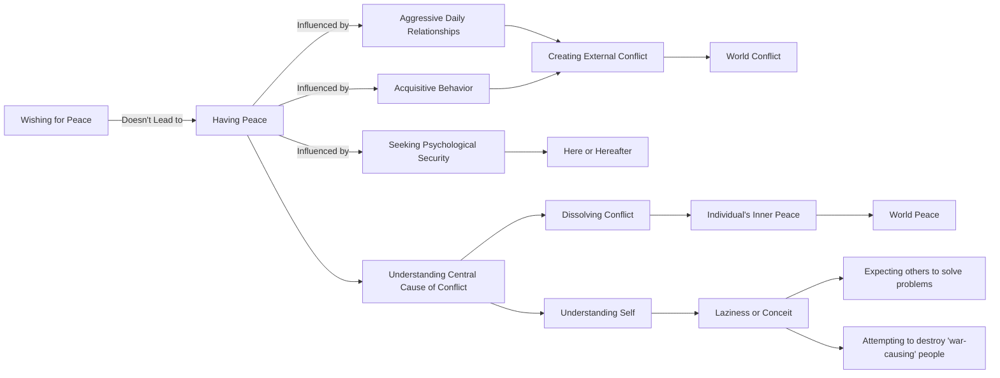

June 24
The central cause of conflict

Do not think by merely wishing for peace, you will have peace, when in your daily life of relationship you are aggressive, acquisitive, seeking psychological security here or in the hereafter. You have to understand the central cause of conflict and sorrow and then dissolve it and not merely look to the outside for peace. But yo u see, most of us are indolent. We are too lazy to take hold of ourselves and understand ourselves, and being lazy, which is really a form of conceit, we think others will solve this problem for us and give us peace, or that we should destroy the apparently few people that are causing wars. When the individual is in conflict within himself he must inevitably create conflict without, and only he can bring about peace within himself and so in the world, for he is the world.

