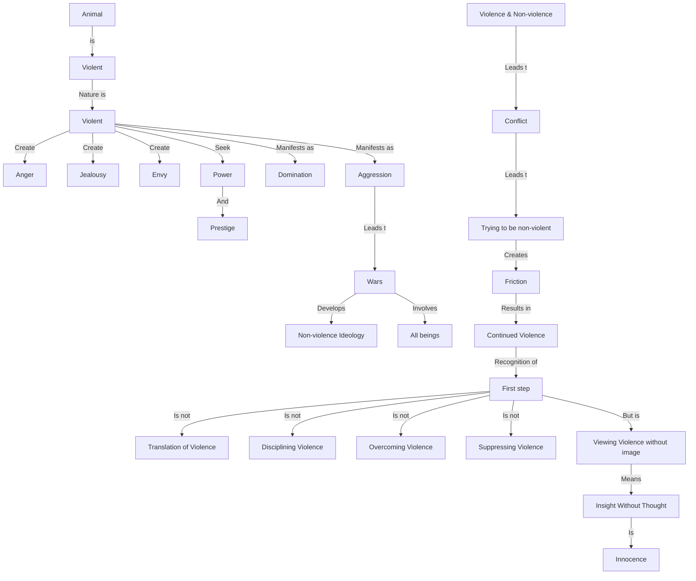

June 25
Realize you are violent

The animal is violent. Human beings who are the result of the animal, are also violent; it is part of their being to be violent, to be angry, to be jealous, to be envious, to seek power, position, prestige and all the rest of it, to dominate, to be aggressive. Man is violent — this is shown by thousands of wars — and he has developed an ideology which he calls “non-violence”. And when there is actual violence as a war between this country and the next country, everybody is involved in it. They love it. Now, when you are actually violent and you have an ideal of non-violence, you have a conflict. You are always trying to become non-violent — which is a part of the conflict. You discipline yourself in order not to be violent — which, again, is a conflict, friction. So when you are violent and have the ideal of non-violence, you are essentially violent. To realize that you are violent is the first thing to do—not try to become non-violent. To see violence as it is, not try to translate it, not to discipline it, not to overcome it, not to suppress it, but to see it as though you are seeing it for the first time — that is to look at it without any thought. I have explained already what we mean by looking at a tree with innocence — which is to look at it without the image. In the same way, you have to look at violence without the image which is involved in the word itself. To look at it without any movement of thought is to look at it as though you are looking at it for the first time, and therefore looking at it with innocence.

