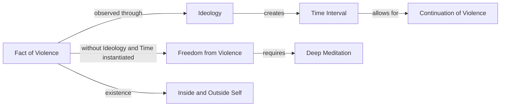

June 26
Freedom from violence

So can you see the fact of violence — the fact not only outside of you but also inside you — and not have any time interval between listening and acting? This means by the very act of listening you are free from violence. You are totally free from violence because you have not admitted time, an ideology through which you can get rid of violence. This requires very deep meditation, not just a verbal agreement or disagreement. We never listen to anything; our minds, our brain cells are so conditioned to an ideology about violence that we never look at the fact of violence. We look at the fact of violence through an ideology, and the looking at violence through an ideology creates a time interval. And when you admit time, there is no end to violence; you go on showing violence, preaching non-violence.

