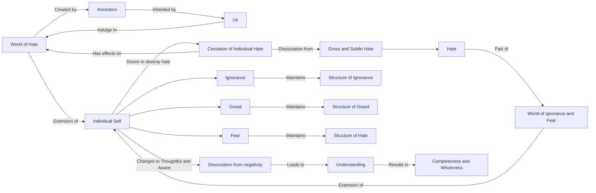

June 29
To destroy hate

We see the world of hate taking its harvest at the present. This world of hate has been created by our fathers and their forefathers and by us. Thus ignorance stretches indefinitely into the past. It has not come into being by itself. It is the outcome of human ignorance, a historical process, isn’t it? We as individuals have cooperated with our ancestors, who, with their forefathers, set going this process of hate, fear, greed, and so on. Now, as individuals, we partake of this world of hate so long as we, individually, indulge in it.
The world, then, is an extension of yourself. If you as an individual desire to destroy hate, then you as an individual must cease hating. To destroy hate, you must dissociate yourself from hate in all its gross and subtle forms, and so long as you are caught up in it you are part of that world of ignorance and fear. Then the world is an extension of yourself, yourself duplicated and multiplied. The world does not exist apart from the individual. It may exist as an idea, as a state, as a social organization, but to carry out that idea, to make that social or religious organization function, there must be the individual. His ignorance, his greed, and his fear maintain the structure of ignorance, greed, and hate. If the individual changes, can he affect the world, the world of hate, greed, and so on? The world is an extension of yourself so long as you are thoughtless, caught up in ignorance, hate, greed, but when you are earnest, thoughtful and aware, there is not only a dissociation from those ugly causes that create pain and sorrow, but also in that understanding there is a completeness, a wholeness.

