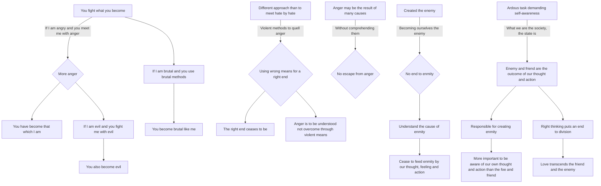

June 30
That thing which you fight you become

Surely that thing which you fight you become. If I am angry and you meet me with anger what is the result? More anger. You have become that which I am. If I am evil and you fight me with evil means then you also become evil, however righteous you may feel. If I am brutal and you use brutal methods to overcome me, then you become brutal like me. And this we have done thousands of years. Surely there is a different approach than to meet hate by hate? If I use violent methods to quell anger in myself then I am using wrong means for a right end, and thereby the right end ceases to be. In this there is no understanding; there is no transcending anger. Anger is to be studied tolerantly and understood; it is not to be overcome through violent means. Anger may be the result of many causes and without comprehending them there is no escape from anger.
We have created the enemy, the bandit, and becoming ourselves the enemy in no way brings about an end to enmity. We have to understand the cause of enmity and cease to feed it by our thought, feeling and action. This is an arduous task demanding constant self-awareness and intelligent pliability, for what we are the society, the state is. The enemy and the friend are the outcome of our thought and action. We are responsible for creating enmity and so it is more important to be aware of our own thought and action than to be concerned with the foe and the friend, for right thinking puts an end to division. Love transcends the friend and the enemy.

