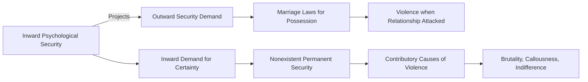

June 27
The major cause of violence

The major cause of violence, I think, is that each one of us is inwardly, psychologically, seeking security. In each one of us the urge for psychological security — that inward sense of being safe — projects the demand, the outward demand, for security. Inwardly each one of us wants to be secure, sure, certain. That is why we have all these marriage laws; in order that we may possess a woman, or a man, and so be secure in our relationship. If that relationship is attacked we become violent, which is the psychological demand, the inward demand, to be certain of our relationship to everything. But there is no such thing as certainty, security, in any relationship. Inwardly, psychologically, we should like to be secure, but there is no such thing as permanent security. So all these are the contributory causes of the violence that is prevalent, rampaging, throughout the world. I think anybody who has observed, even if only a little, what is going on in the world, and especially in this unfortunate country, can also, without a great deal of intellectual study, observe and find out in himself those things which, projected outwardly, are the causes of this extraordinary brutality, callousness, indifference, violence.

