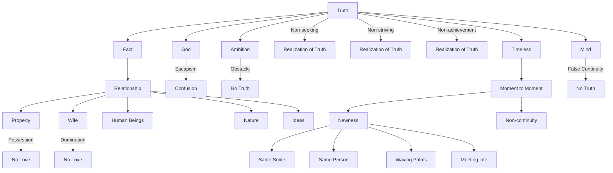

August 3
Truth has no abiding place

Truth is a fact, and the fact can be understood only when the various things that have been placed between the mind and the fact are removed. The fact is your relationship to property, to your wife, to human beings, to nature, to ideas; and as long as you do not understand the fact of relationship, your seeking God merely increases the confusion because it is a substitution, an escape, and therefore it has no meaning. As long as you dominate your wife or she dominates you, as long as you possess and are possessed, you cannot know love; as long as you are suppressing, substituting, as long as you are ambitious, you cannot know truth.
He alone sha ll know truth who is not seeking, who is not striving, who is not trying to achieve a result...Truth is not continuous, it has no abiding place, it can be seen only from moment to moment. Truth is always new, therefore timeless. What was truth yesterday is not truth today, what is truth today is not truth tomorrow. Truth has no continuity. It is the mind which wants to make the experience which it calls truth continuous, and such a mind shall not know truth. Truth is always new; it is to see the same smile, and see that smile newly, to see the same person, and see that person anew, to see the waving palms anew, to meet life anew.

