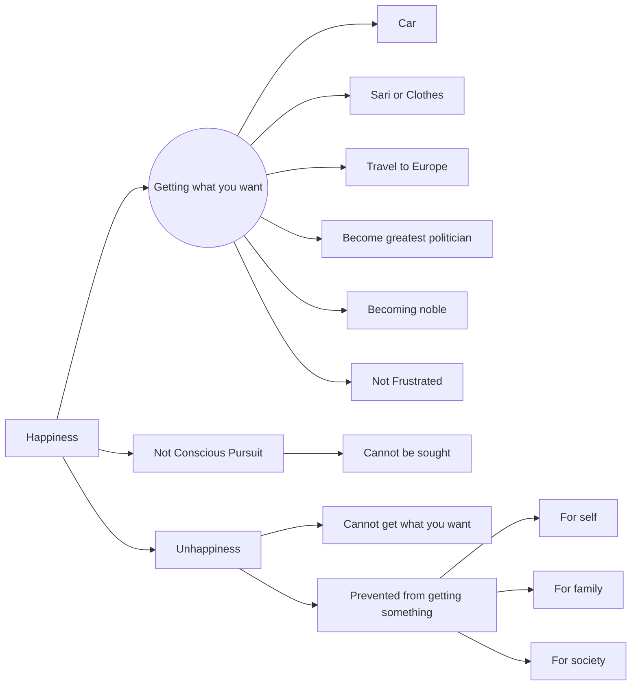

July 3
Happiness cannot be pursued

What do you mean by happiness? Some will say happiness consists in getting what you want. You want a car, and you get it, and you are happy. I want a sari or clothes; I want to go to Europe and if I can, I am happy. I want to be the greatest politician, and if I get it, I am happy; if I cannot get it, I am unhappy. So, what you call happiness is getting what you want, achievement or success, becoming noble, getting anything that you want. As long as you want something and you can get it, you feel perfectly happy; you are not frustrated, but if you cannot get what you want, then unhappiness begins. All of us are concerned with this, not only the rich and the poor. The rich and the poor all want to get something for themselves, for their family, for society; and if they are prevented, stopped, they will be unhappy. We are not discussing, we are not saying that the poor should not have what they want. That is not the problem. We are trying to find out what is happiness and whether happiness is something of which you are conscious. The moment you are conscious that you are happy, that you have much, is that happiness? The moment you are conscious that you are happy, it is not happiness, is it? So you cannot go after happiness. The moment you are conscious that you are humble, you are not humble. So happiness is not a thing to be pursued; it comes. But if you seek it, it will evade you.

