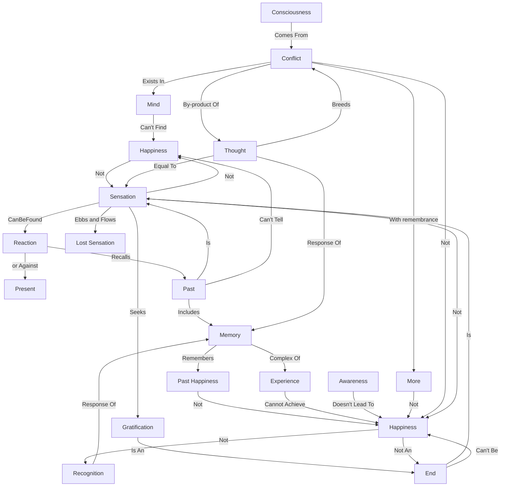

July 4
Happiness is not sensation

Mind can never find happiness. Happiness is not a thing to be pursued and found, as sensation. Sensation can be found again and again, for it is ever being lost; but happiness cannot be found. Remembered happiness is only a sensation, a reaction for or against the present. What is over is not happiness; the experience of happiness which is over is sensation, for remembrance is the past and the past is sensation. Happiness is not sensation.
What you know is the past, not the present; and the past is sensation, reaction, memory. You remember that you were happy; and can the past tell what happiness is? It can recall but it cannot be. Recognition is not happiness; to know what it is to be happy, is not happiness. Recognition is the response of memory; and can the mind, the complex of memories, experiences, ever be happy? The very recognition prevents the experiencing.
When you are aware that you are happy, is there happiness? When there is happiness, are you aware of it? Consciousness comes only with conflict, the conflict of remembrance of the more. Happiness is not the remembrance of the more. Where there is conflict, happiness is not. Conflict is where the mind is. Thought at all levels is the response of memory, and so thought invariably breeds conflict. Thought is sensation, and sensation is not happiness. Sensations are ever seeking gratifications. The end is sensation, but happiness is not an end; it cannot be sought out.

