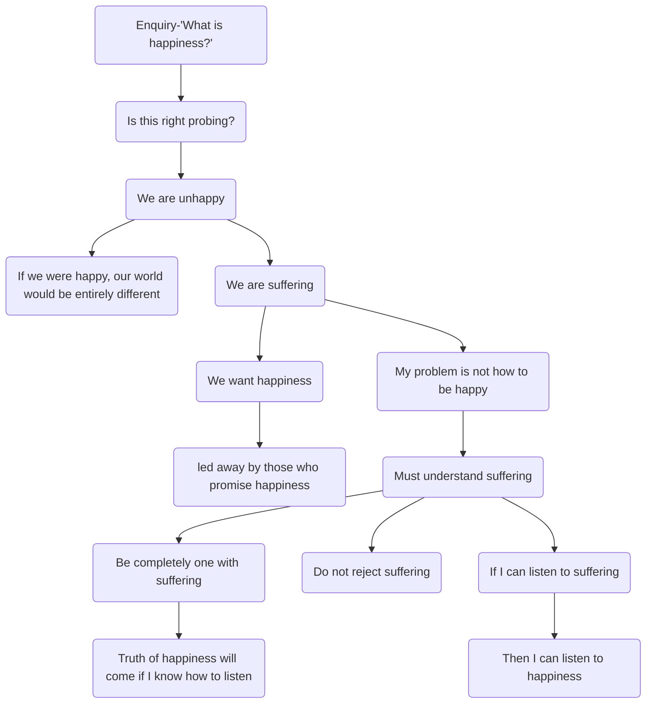

July 7
Understanding suffering

Why do we enquire “what is happiness?” Is tha t the right approach? Is that the right probing? We are not happy. If we were happy, our world would be entirely different; our civilization, our culture would be wholly, radically different. We are unhappy human beings, petty, miserable, struggling, vain, surrounding ourselves with useless, futile things, satisfied with petty ambitions, with money, and position. We are unhappy beings, though we may have knowledge, though we may have money, rich houses, plenty of children, cars, experience. We are unhappy, suffering, human beings, and because we are suffering, we want happiness, and so we are led away by those who promise this happiness, social, economic or spiritual...What is the good of my asking if there is happiness when I am suffering? Can I understand suffering? That is my problem, not how to be happy. I am happy when I am not suffering, but the moment I am conscious of it, it is not happiness...So, I must understand what is suffering. Can I understand what is suffering when a part of my mind is running away seeking happiness, seeking a way out of this misery? So must I not, if I am to understand suffering, be completely one with it, not reject it, not justify it, not condemn it, not compare it, but completely be with it and understand it?
The truth of what is happiness will come if I know how to listen. I must know how to listen to suffering; if I can listen to suffering I can listen to happiness because that is what I am.

