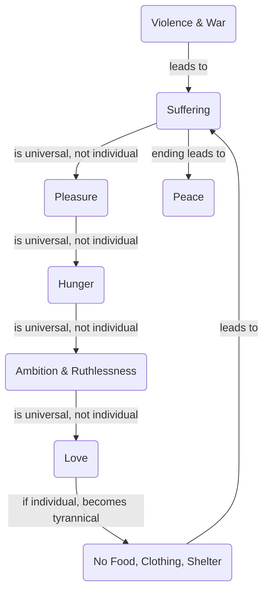

July 8
Suffering is suffering, not yours or mine

Is your suffering as an individual different from my suffering, or from the suffering of a man in Asia, in America, or in Russia? The circumstances, the incidents may vary, but in essence another man’s suffering is the same as mine and yours, isn’t it? Suffering is suffering, surely, not yours or mine. Pleasure is not your pleasure, or my pleasure—it is pleasure. When you are hungry, it is not your hunger only, it is the hunger of the whole of Asia too. When you are driven by ambition, when you are ruthless, it is the same ruthlessness that drives the politician, the man in power, whether he is in Asia, in America, or in Russia.
You see, that is what we object to. We don’t see that we are all one humanity, caught in different spheres of life, in different areas. When you love somebody, it is not your love. If it is, it becomes tyrannical, possessive, jealous, anxious, brutal. Similarly, suffering is suffering; it is not yours or mine. I am not just making it impersonal, I am not making it something abstract. When one suffers, one suffers. When a man has no food, no clothing, no shelter, he is suffering, whether he lives in Asia, or in the West. The people who are now being killed or wounded—the Vietnamese and the Americans — are suffering. To understand this suffering—which is neither yours nor mine, which is not impersonal or abstract, but actual and which we all have—requires great deal of penetration, insight. And the ending of this suffering will naturally bring about peace, not only within, but outside.

