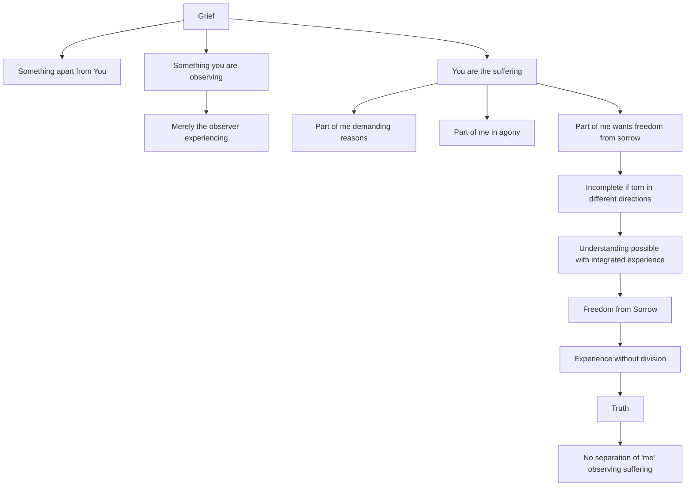

July 11
Integrated understanding

What do we mean by “grief”? Is it something apart from you?
Is it something outside of you, inwardly or outwardly, which you are observing, which you are experiencing? Are you merely the observer experiencing? Or, is it something different? Surely that is an important point, is it not? When I say “I suffer,” what do I mean by it? Am I different from the suffering? Surely that is the question, is it not? Let us find out.
There is sorrow — I am not loved, my son dies, what you will. There is one part of me that is demanding why, demanding the explanation, the reasons, the causes. The other part of me is in agony for various reasons. And there is also another part of me which wants to be free from the sorrow, which wants to go beyond it. We are all these things, are we not? So, if one part of me is rejecting, resisting sorrow, another part of me is seeking an explanation, is caught up in theories, and another part of me is escaping from the fact — how then can I understand it totally? It is only when I am capable of integrated understanding that there is a possibility of freedom from sorrow. But if I am torn in different directions, then I do not see the truth of it.
Now, please listen carefully; and you will see that when there is a fact, a trut h, there is understanding of it only when I can experience the whole thing without division—and not when there is the separation of the “me” observing suffering. That is the truth.

