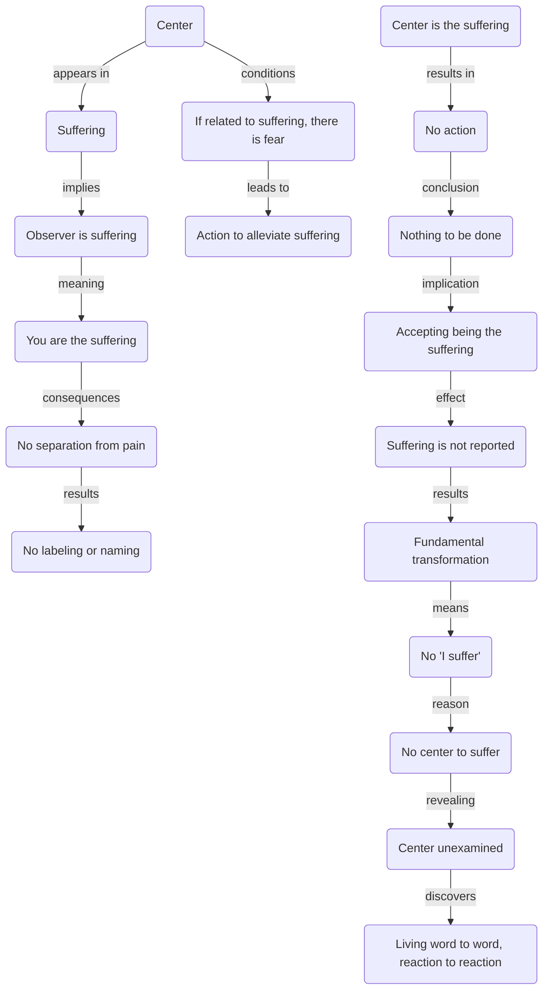

July 12
You are the suffering

When there is no observer who is suffering, is the suffering different from you? You are the suffering, are you not? You are not apart from the pain—you are the pain. What happens? There is no labeling, there is no giving it a name and thereby brushing it aside—you are merely that pain, that feeling, that sense of agony. When you are that, what happens? When you do not name it, when there is no fear with regard to it, is the center related to it? If the center is related to it, then it is afraid of it. Then it must act and do something about it. But if the center is that, then what do you do? There is nothing to be done, is there? If you are that and you are not accepting it, not labeling it, not pushing it aside—if you are that thing, what happens? Do you say you suffer then? Surely, a fundamental transformation has taken place. Then there is no longer “I suffer,” because there is no center to suffer and the center suffers because we have never examined what the center is. We just live from word to word, from reaction to reaction.

