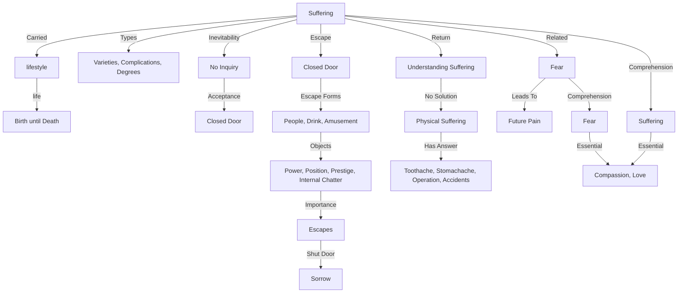

July 13
Is suffering essential?

There are so many varieties and complications and degrees of suffering. We all know that. You know it very well, and we carry this burden right through life, practically from the moment we are born until the moment we collapse into the grave...
If we say that it is inevitable, then there is no answer; if you accept it, then you have stopped inquiring into it. You have closed the door to further inquiry; if you escape from it, you have also closed the door. You may escape into man or woman, into drink, amusement, into various forms of power, position, prestige, and the internal chatter of nothingness. Then your escapes become all-important; the objects to which you fly assume colossal importance. So you have shut the door on sorrow also, and that is what most of us do...Now, can we stop escape of every kind and come back to suffering?...That means not seeking a solution for suffering. There is physical suffering—a toothache, stomachache, an operation, accidents, various forms of physical sufferings which have their own answer. There is also the fear of future pain, which would cause suffering. Suffering is closely related to fear and, and without comprehension of these two major factors in life, we shall never comprehend what it is to be compassionate, to love. So a mind that is concerned with the comprehension of what is compassion, love, and all the rest of it must surely understand what is fear and what is sorrow.

