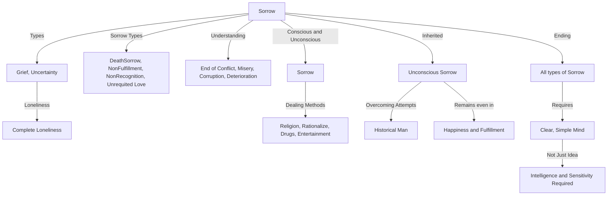

July 14
Conscious sorrow and unconscious sorrow

Sorrow is...grief, uncertainty, the feeling of complete loneliness. There is the sorrow of death, the sorrow of not being able to fulfil oneself, the sorrow of not being recognized, the sorrow of loving and not being loved in return. There are innumerable forms of sorrow, and it seems to me that without understanding sorrow, there is no end to conflict, to misery, to the everyday travail of corruption and deterioration...
There is conscious sorrow, and there is also unconscious sorrow, the sorrow that seems to have no basis, no immediate cause. Most of us know conscious sorrow, and we also know how to deal with it. Either we run away from it through religious belief or we rationalize it, or we take some kind of drug, whether intellectual or physical; or we bemuse ourselves with words, with amusements, with superficial entertainment. We do all this, and yet we cannot get away from conscious sorrow.
Then there is the unconscious sorrow that we have inherited through the centuries. Man has always sought to overcome this extraordinary thing called sorrow, grief,misery; but even when we are superficially happy and have everything we want, deep down in the unconscious there are still the roots of sorrow. So when we talk about the ending of sorrow, we mean the ending of all sorrow, both conscious and unconscious.
To end sorrow one must have a very clear, very simple mind. Simplicity is not a mere idea. To be simple demands a great deal of intelligence and sensitivity.

