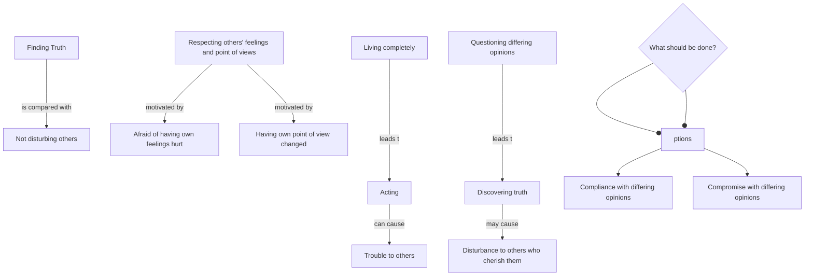

July 15
Hurt feelings

How should we act in order not to trouble others?” Is that what you want to know? I am afraid then we should not be acting at all. If you live completely, your actions may cause trouble; but what is more important: finding out what is true, or not disturbing others? This seems so simple that it hardly needs to be answered. Why do you want to respect other people’s feelings and points of view? Are you afraid of having your own feelings hurt, your point of view being changed? If people have opinions that differ from yours, you can find out if they are true only by questioning them, by coming into active contact with them. And if you find that those opinions and feelings are not true, your discovery may cause disturbance to those who cherish them. Then what should you do? Should you comply with them, or compromise with them in order not to hurt your friends?

