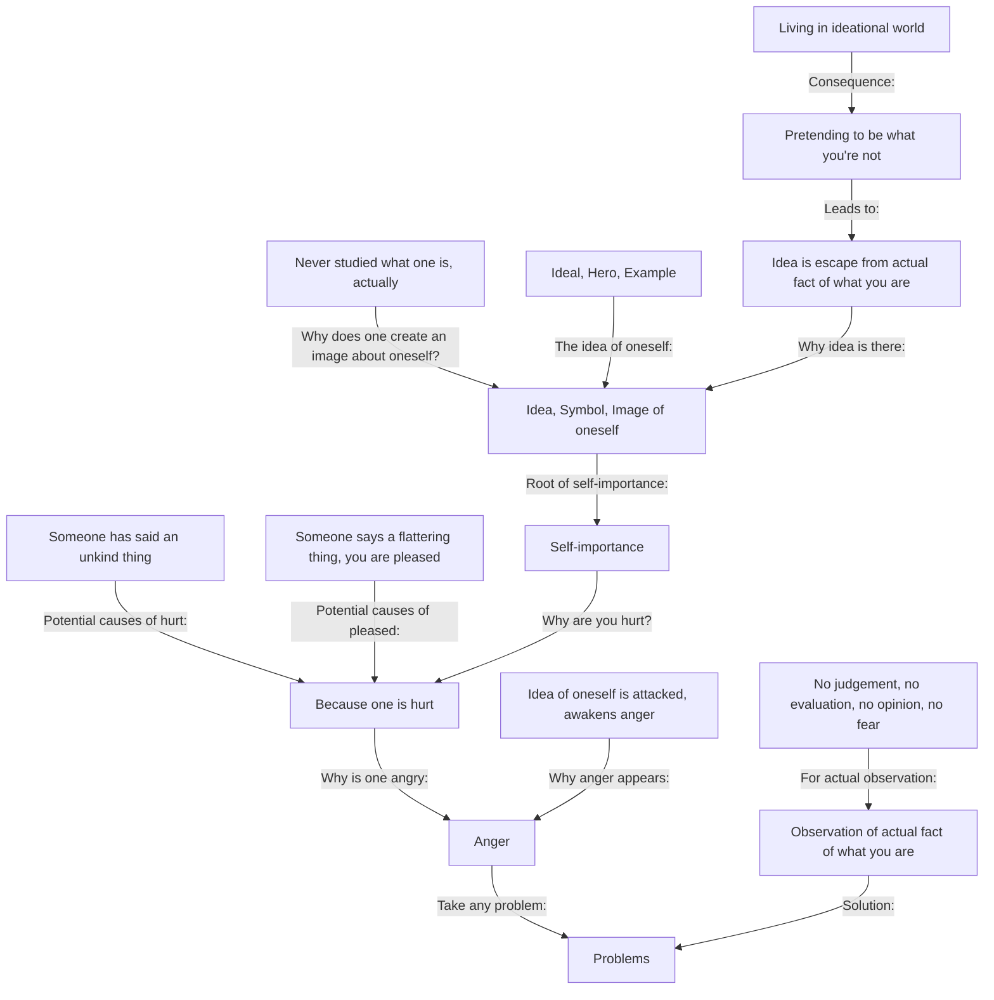

July 16
Self-image leads to pain

Why divide problems as major and minor? Is not everything a problem? Why make them little or big problems, essential or unessential problems? If we could understand one problem, go into it very deeply however small or big it is, then we would uncover all problems. This is not a rhetorical answer. Take any problem: anger, jealousy, envy, hatred—we know them all very well. If you go into anger very deeply, not just brush it aside, then what is involved? Why is one angry? Because one is hurt, someone has said an unkind thing; and when someone says a flattering thing you are pleased. Why are you hurt? Self-importance, is it not? And why is there self-importance?
Because one has an idea, a symbol of oneself, an image of oneself, what one should be, what one is or what one should not be. Why does one create an image about oneself? Because one has never studied what one is, actually. We think we should be this or that, the ideal, the hero, the example. What awakens anger is that our ideal, the idea we have of ourselves, is attacked. And our idea about ourselves is our escape from the fact of what we are. But when you are observing the actual fact of wha t you are, no one can hurt you. Then, if one is a liar and is told that one is a liar it does not mean that one is hurt; it is a fact. But when you are pretending you are not a liar and are told that you are, then you get angry, violent. So we are always living in an ideational world, a world of myth and never in the world of actuality. To observe what is, to see it, actually be familiar with it, there must be no judgment, no evaluation, no opinion, no fear.

