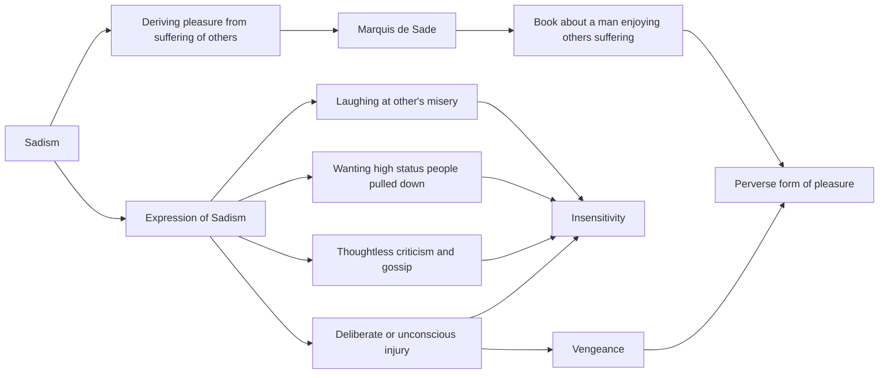

July 17
Perverted pleasure

There is such a thing as sadism. Do you know what that word means? An author called the Marquis de Sade once wrote a book about a man who enjoyed hurting people and seeing them suffer. From that comes the word sadism, which means deriving pleasure from the suffering of others. For certain people there is a peculiar satisfaction in seeing others suffer. Watch yourself and see if you have this feeling. It may not be obvious, but if it is there you will find that it expresses itself in the impulse to laugh when somebody falls. You want those who are high to be pulled down; you criticize, gossip thoughtlessly about others, all of which is an expression of insensitivity, a form of wanting to hurt people. One may injure another deliberately, with vengeance, or one may do it unconsciously with a word, with a gesture with a look; but in either case the urge is to hurt somebody, and there are very few who radically set aside this perverted form of pleasure.

