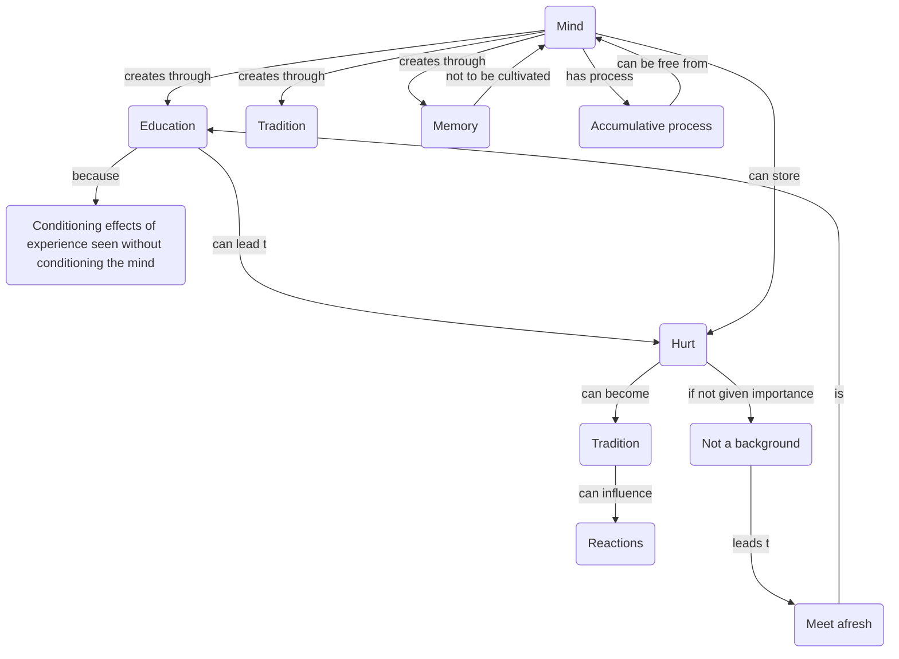

July 18
Real education

The mind creates through experience, tradition, memory. Can the mind be free from storing up, though it is experiencing? You understand the difference? What is required is not the cultivation of memory but the freedom from the accumulative process of the mind.You hurt me, which is an experience; and I store up that hurt; and that becomes my tradition; and from that tradition, I look at you, I react from that tradition. That is the everyday process of my mind and your mind. Now, is it possible that, though you hurt me, the accumulative process does not take place. The two processes are entirely different.
If you say harsh words to me, it hurts me; but if that hurt is not given importance, it does not become the background from which I act; so it is possible that I meet you afresh. That is real education, in the deep sense of the word. Because, then, though I see the conditioning effects of experience, the mind is not conditioned.

