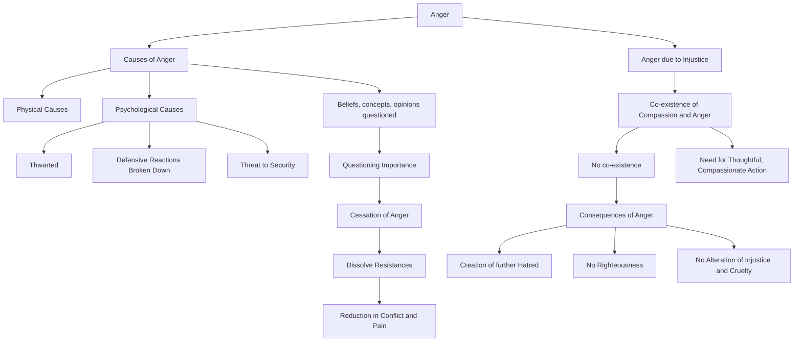

July 19
Cessation of anger

We have all, I am sure, tried to subdue anger but somehow that does not seem to dissolve it. Is there a different approach to dissipate anger?...Anger may spring from physical or psychological causes. One is angry, perhaps, because one is thwarted, one’s defensive reactions are being broken down, or one’s security which has been carefully built up is being threatened, and so on. We are all familiar with anger. How is one to understand and dissolve anger? If you consider that your beliefs, concepts, opinions, are of the greatest importance, then you are bound to react violently when questioned. Instead of clinging to beliefs, opinions, if you begin to question whether they are essential to one’s comprehension of life, then through the understanding of its causes there is the cessation of anger. Thus one begins to dissolve one’s own resistances which cause conflict and pain. This again requires earnestness. We are used to controlling ourselves for sociological or religious reasons or for convenience, but to uproot anger requires deep awareness...
You say you are angry when you hear of injustice. Is it because you love humanity, because you are compassionate? Do compassion and anger dwell together? Can there be justice when there is anger, hatred? You are perhaps angry at the thought of general injustice, cruelty, but your anger does not alter injustice or cruelty; it can only do harm. To bring about order, you yourself have to be thoughtful, compassionate. Action born of hatred can only create further hatred. There can be no righteousness where there is anger. Righteousness and anger cannot dwell together.

