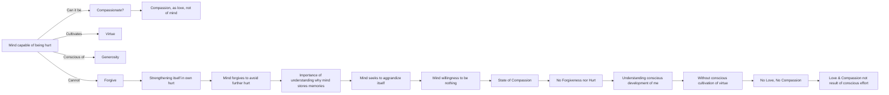

July 20
Forgiveness is not true compassion

What is it to be compassionate? Please find out for yourself, feel it out, whether a mind that is hurt, that can be hurt, can ever forgive. Can a mind that is capable of being hurt, ever forgive? And can such a mind which is capable of being hurt, which is cultivating virtue, which is conscious of generosity, can such a mind be compassionate? Compassion, as love, is something which is not of the mind. The mind is not conscious of itself as being compassionate, as loving. But the moment you forgive consciously, the mind is strengthening its own center in its own hurt. So the mind which consciously forgives can never forgive; it does not know forgiveness; it forgives in order not to be further hurt.
So it is very important to find out why the mind actually remembers, stores away. Because the mind is everlastingly seeking to aggrandize itself, to become big, to be something When the mind is willing not to be anything, to be nothing, completely nothing, then in that state there is compassion. In that state there is neither forgiveness nor the state of hurt; but to understand that, one has to understand the conscious development of the “me”.
So, as long as there is the conscious cultivation of any particular influence, any particular virtue, there can be no love, there can be no compassion, because love and compassion are not the result of conscious effort.

