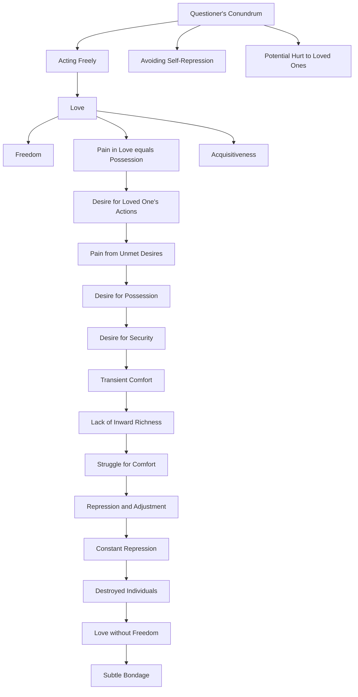

July 21
Where there is the possibility of pain there is no love

The questioner wants to know how he can act freely and without self-repression when he knows his action must hurt those he loves. You know, to love is to be free—both parties are free. Where there is the possibility of pain, where there is the possibility of suffering in love, it is not love, it is merely a subtle form of possession, of acquisitiveness. If you love, really love someone, there is no possibility of giving him pain when you do something that you think is right. It is only when you want that person to do what you desire or he wants you to do what he desires, that there is pain. That is, you like to be possessed; you feel safe, secure, comfortable; though you know that comfort is but transient, you take shelter in that comfort, in that transience. So each struggle for comfort, for encouragement, really but betrays the lack of inward richness; and therefore an action separate, apart from the other individual naturally creates disturbance, pain and suffering; and one individual has to suppress what he really feels in order to adjust himself to the other. In other words, this constant repression, brought about by so-called love, destroys the two individuals. In that love there is no freedom; it is merely a subtle bondage.

