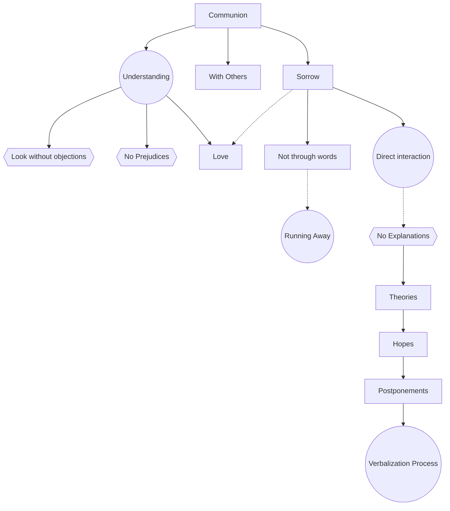

July 31
Be in communion with sorrow

Most of us are not in communion with anything. We are not directly in communion with our friends, with our wives, with our children...
So to understand sorrow, surely you must love it, must you not? That is, you must be in direct communion with it. If you would understand something—your neighbor, your wife, or any relationship—if you would understand something completely, you must be near it. You must come to it without any objection, prejudice, condemnation, or repulsion; you must look at it, must you not? If I would understand you, I must have no prejudices about you. I must be capable of looking at you, not through barriers, screens of my prejudices and conditionings. I must be in communion with you, which means I mustlove you. Similarly, if I would understand sorrow, I must love it, I must be in communion with it. I cannot do so because I am running away from it through explanations, through theories, through hopes, through postponements, which are all the process of verbalization. So words prevent me from being in communion with sorrow. Words prevent me—words of explanations, rationalizations, which are still words, which are the mental process—from being directly in communion with sorrow. It is only when I am in communion with sorrow that I understand it.

