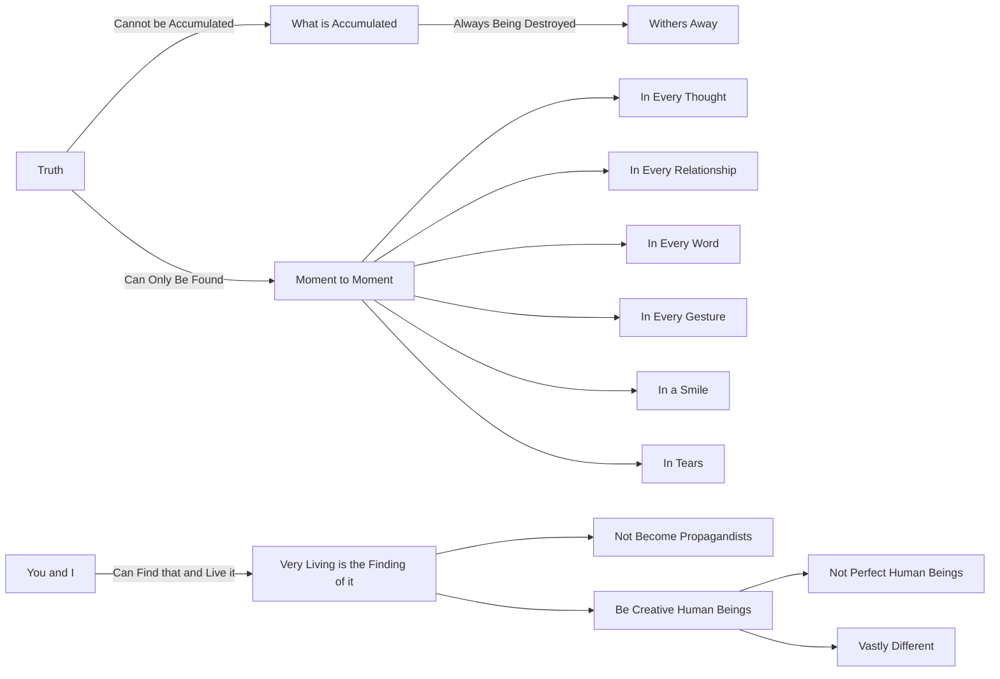

August 5
Truth is found moment to moment

Truth cannot be accumulated. What is accumulated is always being destroyed; it withers away. Truth can never wither because it can only be found from moment to moment in every thought, in every relationship, in every word, in every gesture, in a smile, in tears. And if you and I can find that and live it—the very living is the finding of it—then we shall not become propagandists; we shall be creative human beings—not perfect human beings, but creative human beings, which is vastly different.

