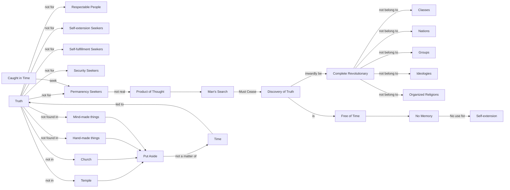

August 6
The true revolutionary

Truth is not for those who are respectable, nor for those who desire self-extension, self- fulfillment. Truth is not for those who are seeking security, permanency; for the permanency they seek is merely the opposite of impermanency. Being caught in the net of time, they seek that which is permanent, but the permanent they seek is not the real because what they seek is the product of their thought. Therefore, a man who would discover reality must cease to seek—which does not mean that he must be contented with what is. On the contrary, a man who is intent upon the discovery of truth must be inwardly a complete revolutionary. He cannot belong to any class, to any nation, to any group or ideology, to any organized religion; for truth is not in the temple or the church, truth is not to be found in the things made by the hand or by the mind. Truth comes into being only when the things of the mind and of the hand are put aside, and that putting aside of the things of the mind and of the hand is not a matter of time. Truth comes to him who is free of time, who is not using time as a means of self-extension. Time means memory of yesterday, memory of your family, of your race, of your particular character, of the accumulation of your experience which makes up the “me” and the “mine”.

