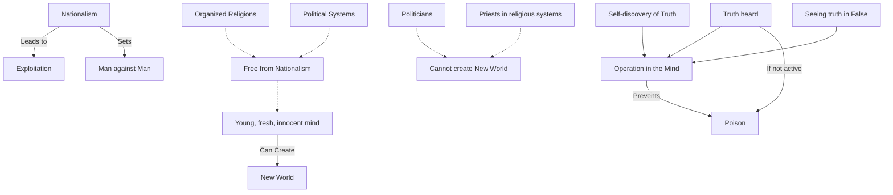

August 7
See the truth in the false

You may superficially agree when you hear it said that nationalism, with all its emotionalism and vested interest, leads to exploitation and the setting of man against man; but to really free your mind from the pettiness of nationalism is another matter. To be free, not only from nationalism but also from all the conclusions of organized religions and political systems, is essential if the mind is to be young, fresh, innocent, that is, in a state of revolution; and it is only such a mind that can create a new world— not the politicians, who are dead, nor the priests, who are caught in their own religious systems.
So, fortunately or unfortunately for yourself, you have heard something which is true; and if you merely hear it and are not active ly disturbed so that your mind begins to free itself from all the things which are making it narrow and crooked, then the truth you have heard will become a poison. Surely, truth becomes a poison if it is heard and does not act in the mind, like the festering of a wound. But to discover for oneself what is true and what is false, and to see the truth in the false, is to let that truth operate and bring forth its own action.

